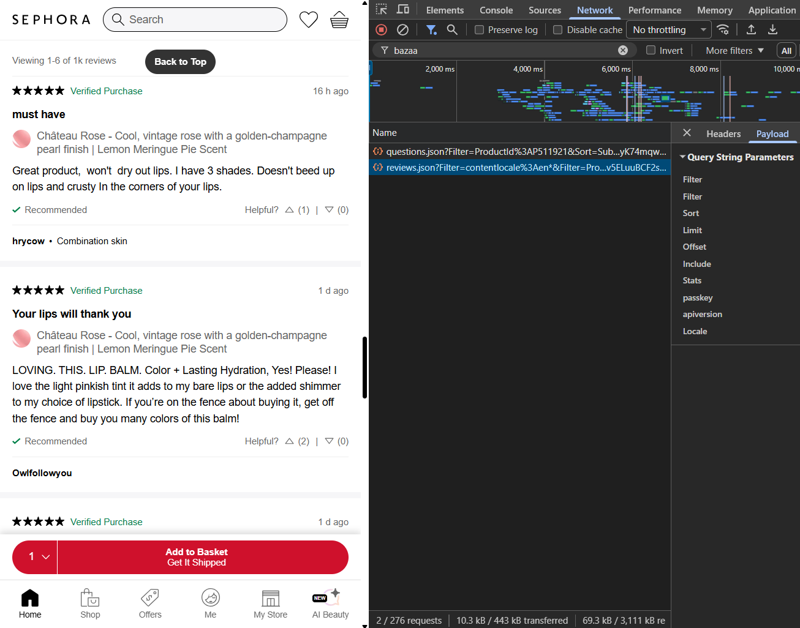

# Como ejecutar el Scraping

obtienen la passkey en reviews buscando bazaarvoice y triggereando el api bajando a los comentarios


luego en el archivo .env asignan la passkey a la variable BAZAARVOICE_PASSKEY

Ahora solo queda ejecutar el pipeline

```bash
python src/ingestion/scraper/sample_scraper.py
```
