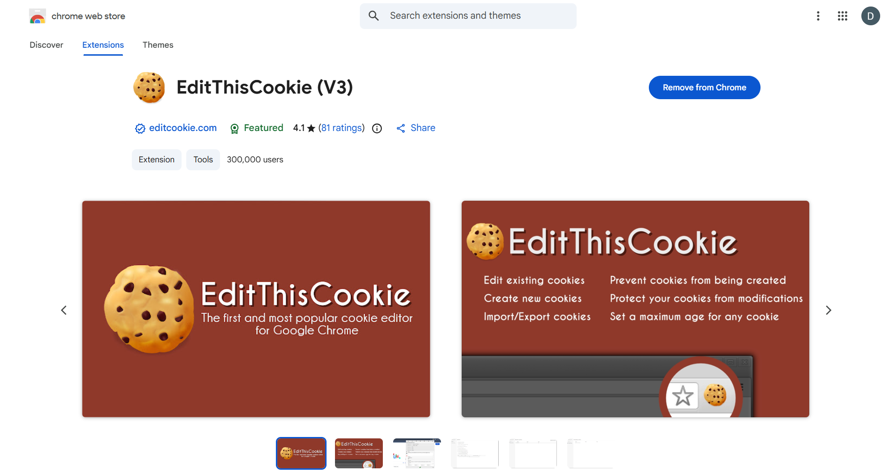
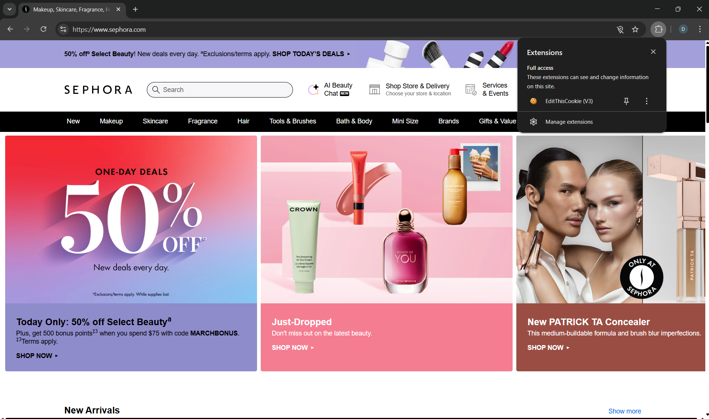
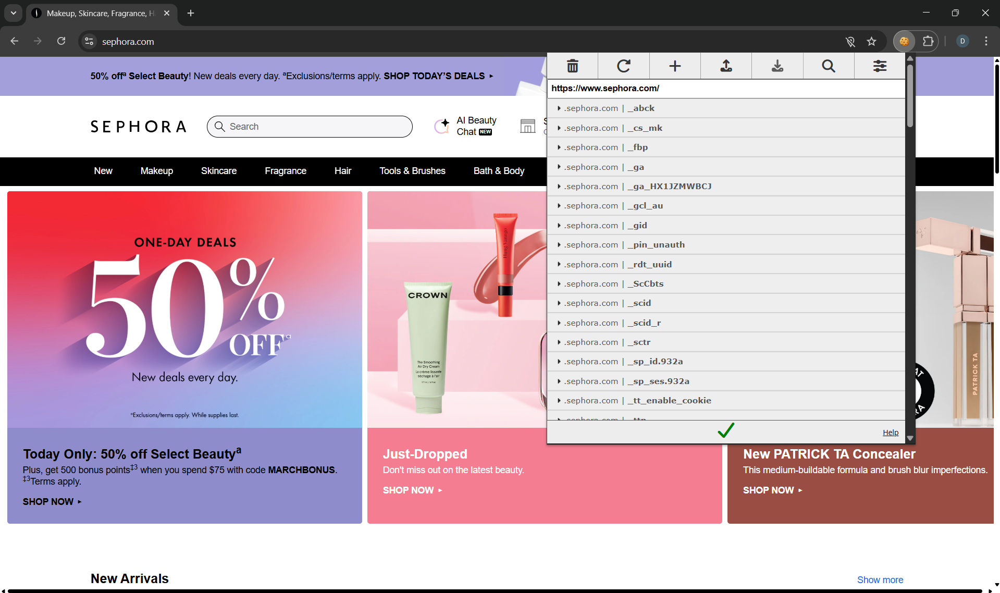
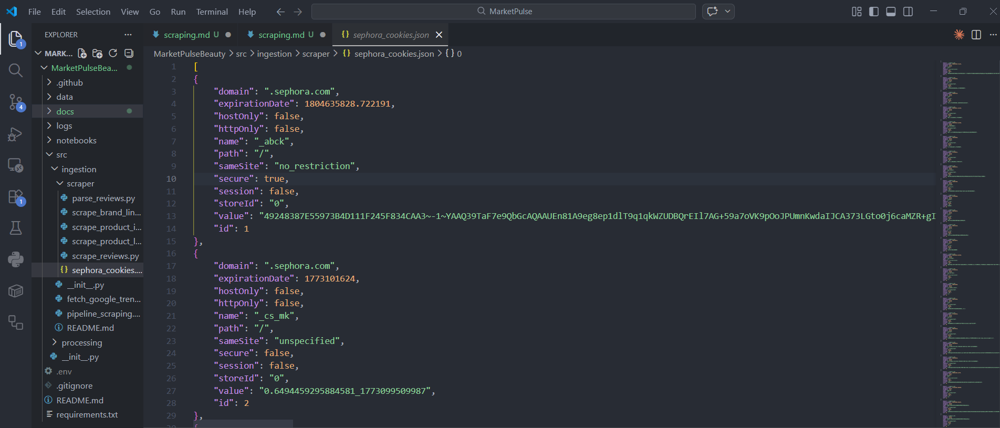
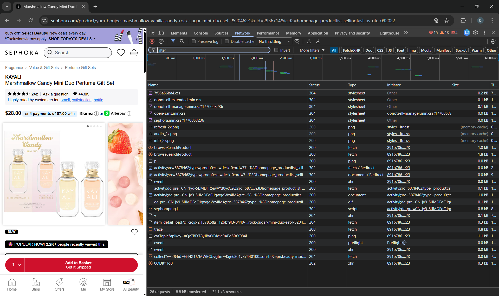
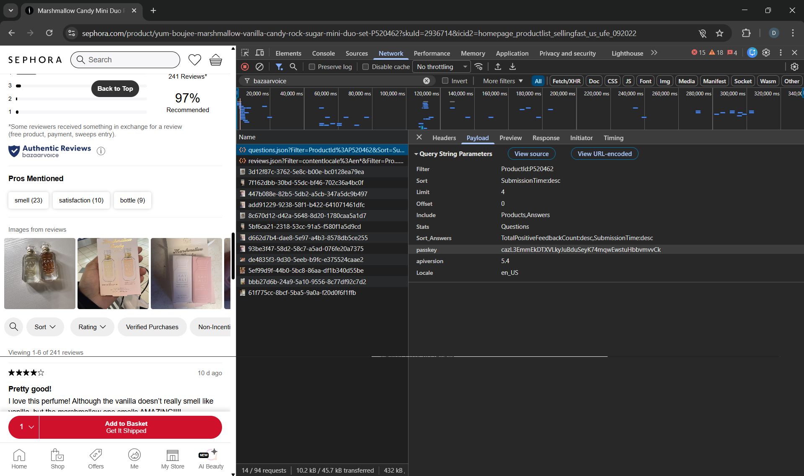
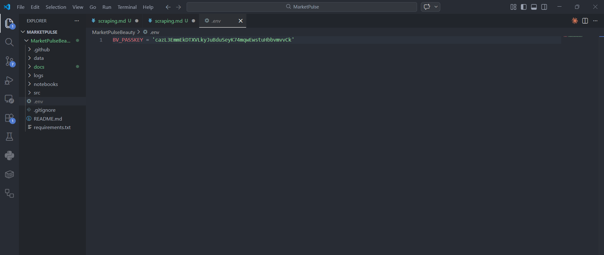

# Como ejecutar el Scraping

Descargar esta extensión: EditThisCookie(V3)


Entrar a la pagina oficial de sephora: sephora.com
y una vez ahí, entrar a la parte de extensiones y oprimir EditThisCookie




Y presionar la flecha hacia abajo, en donde dice exportar, entonces les debe salir un mensaje diciendo: cookies copied to clipboard

Ahora en la carpeta src/ingestion/scraper crean un archivo llamado sephora_cookies.json, y ahí pegan lo del paso anterior



Luego de nuevo vuelven a sephora.com y abren cualquier producto, una vez estén en la página de ese producto entonces presionan f12, les debe salir algo como esto:



En la parte de Network, en el filtro escriben bazaarvoice y luego de esto hacen scroll hacia abajo hasta que llegan a los comentarios, entonces se debe actualizar las cosas que aparecieron en network, entonces entran a cualquier request y en payload copian el valor de la passkey



luego en el archivo .env asignan la passkey a la variable BV_PASSKEY



Ahora solo queda ejecutar el pipeline

```bash
python src/ingestion/pipeline_scraping.py --limit 10
```

El limit indica que tanto quieren descargar, normalmente esta parte se demora bastante.
