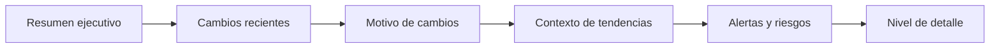

# MarketPulse Beauty
## Retail Intelligence Dashboard para belleza y cuidado personal

Fase 1: vender el valor
Fase 2: como se creo y como se ejecuto

---

# Agenda
- Fase 1: problema, oportunidad, propuesta de valor, demo conceptual
- Fase 2: datos, arquitectura, calidad, metodologia Scrum
- Cierre: resultados y siguientes pasos

---

# Fase 1: Por que esto importa a una pyme
- Mucha data publica, poco tiempo para analizarla
- Reviews y tendencias cambian rapido y se detectan tarde
- Decisiones de producto se toman con intuicion, no con evidencia

Mensaje clave: MarketPulse convierte ruido en decisiones claras

---

# Fase 1: Propuesta de valor
- Automatiza analisis de reviews y tendencias publicas
- Resume el estado del producto en indicadores simples
- Detecta alertas tempranas y oportunidades de mercado
- Reduce tiempo de analisis y acelera decisiones comerciales

---

# Fase 1: Tres pilares del producto
- Health Score del producto (rating + volumen de busquedas)
- Review Insights (temas recurrentes y sentimiento)
- Trend Analysis (interes de busqueda y picos de demanda)

---

# Fase 1: Flujo de decision en el dashboard

Objetivo: que el usuario entienda estado, causa y riesgo en minutos

---

# Fase 1: KPIs y visuales que guian acciones
- Rating promedio, Health Score, volumen de reviews
- Porcentaje de recomendacion y frecuencia de atributos
- Evolucion temporal de reviews y tendencias
- Visuales clave: ranking, barras horizontales, lineas temporales

---

# Fase 2: Como se construyo
- Arquitectura orientada a datos con enfoque DataOps
- Pipeline de ingesta, limpieza, enriquecimiento y delivery
- Diseñado para crecer: scraping, tendencias, alertas

---

# Fase 2: Estrategia de datos
- Fuente principal: Sephora (reviews ricas y con fecha)
- Arranque con dataset Kaggle (1M+ reviews, 8k+ productos)
- Plan de scraping incremental en sprints posteriores
- Limitaciones documentadas: sesgo de categorias, idioma, rating skew

---

# Fase 2: Pipeline y arquitectura
- Medallion: raw -> bronze -> silver -> gold
- Orquestacion con Airflow (5 DAGs: ingestion, silver, gold, trends, data quality)
- Almacenamiento: MinIO (objetos) y PostgreSQL (gold layer)
- Dashboard en Streamlit, todo dockerizado

---

# Fase 2: Inteligencia y calidad
- Motor de insights por producto (rating, volumen, health score, trends)
- Reglas de tendencia con umbrales para alertas
- Monitoreo entre ejecuciones para detectar regresiones
- Validaciones de calidad para asegurar consistencia

---

# Fase 2: Metodologia Scrum aplicada
- 6 sprints de 2 semanas, con eventos formales
- Sprint 1: bases del repo, librerias, fuentes de datos
- Sprint 6: producto analitico, datasets derivados, Docker funcional
- Documentacion por sprint para trazabilidad y mejora continua

---

# Cierre: Valor + ejecucion
- MarketPulse traduce datos publicos en decisiones comerciales
- Un MVP con arquitectura escalable y metodologia solida
- Siguiente paso: demo con casos reales y validacion con pymes
